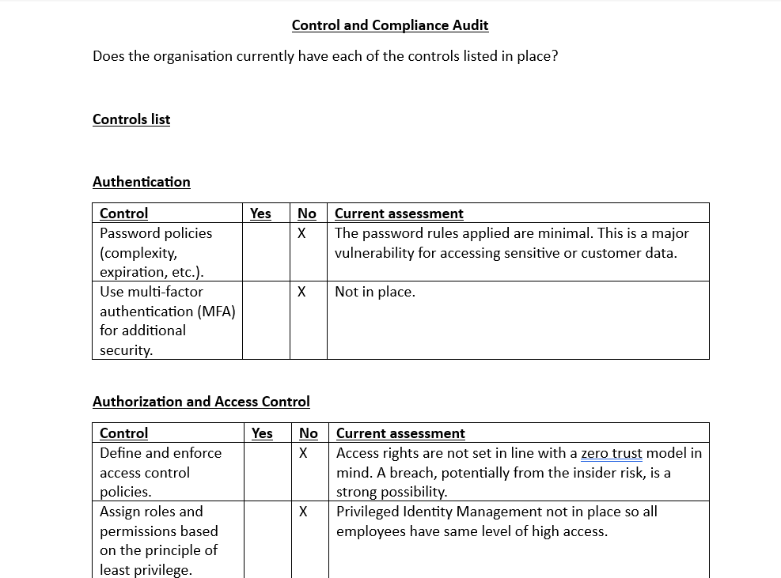
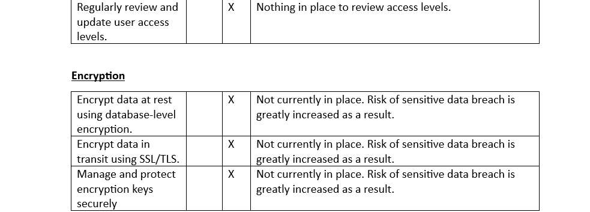
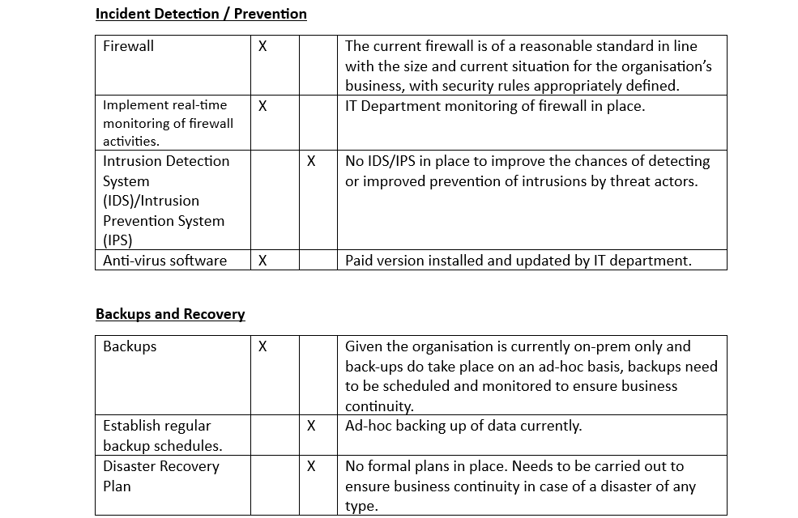
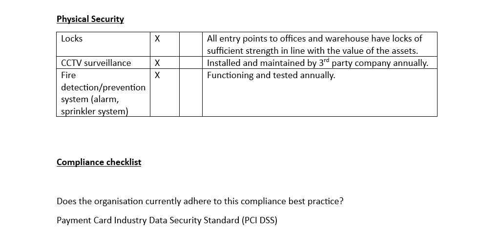
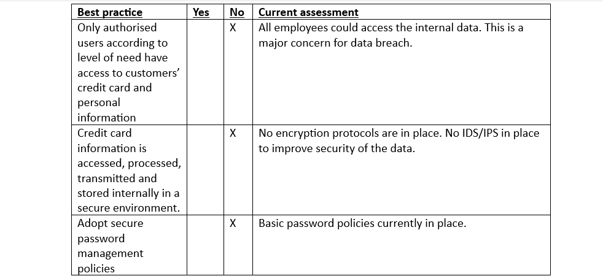
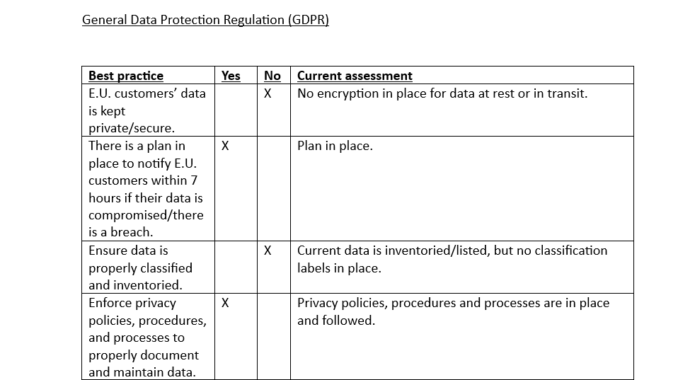
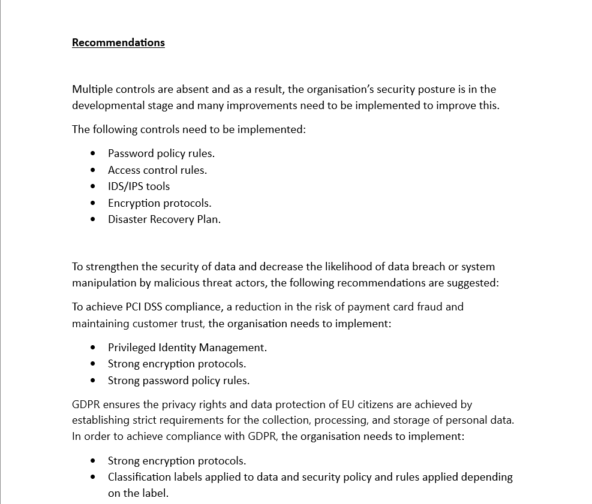

# SecurityAudit

<h1>Scenario:</h1>

The owner of a small business (currently 50 employees) has initiated an internal IT and security audit to ensure data security, business continuity and compliance as the company expands. Compliance with regulations related to online payments and business operations in The European Union (E.U.) is a priority. The IT manager has initiated aligning the organisation with the NIST CSF, defining audit scope and goals, and conducting a risk assessment.

Currently, there is inadequate management of assets. Additionally, the company does not have the proper security controls in place and may not be compliant with U.S. and international regulations and standards.

I undertook a security audit which encompasses compliance, and I have made initial recommendations based on the findings of the audit.
 

 

 

 

 

 

 

 

 

 

 

 

 

 

